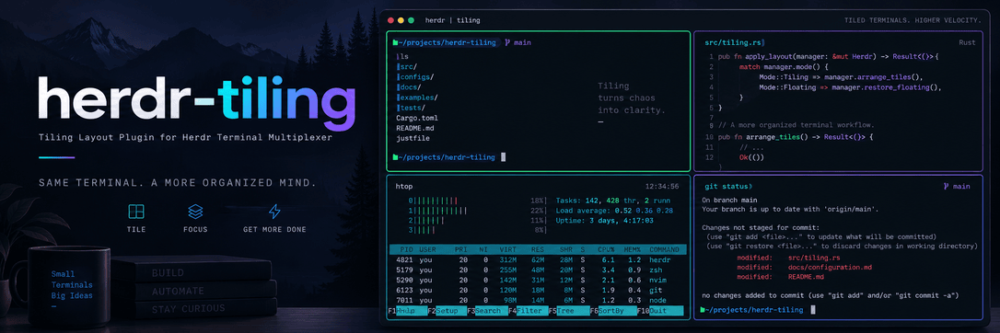

# herdr-tiling

A tiling layout plugin for [Herdr](https://herdr.dev/), inspired by Hyprland's
[Dwindle layout](https://wiki.hypr.land/Configuring/Layouts/Dwindle-Layout/). It adds
directional pane movement, split toggling, and tmux-style preset layouts while
preserving running processes and scrollback.

## Why herdr-tiling?

- Herdr does not provide an action for moving a pane within the layout.
- Herdr does not provide a way to toggle an existing split between horizontal and vertical.
- The same preset layouts as tmux make it quick to arrange every pane in a tab.

## Demo

| Move pane | Toggle split | Preset layouts |
| :---: | :---: | :---: |
|  |  |  |

## Install

Requirements:

- Herdr 0.9.0 or later
- Linux and macOS on x86_64 or arm64
- `curl` or `wget`
- `sha256sum` or `shasum`

Install herdr-tiling directly from GitHub with Herdr's plugin manager. Herdr
downloads and verifies the prebuilt binary, so Rust is not required.

```sh
herdr plugin install jaeheonji/herdr-tiling
```

Add key bindings to `~/.config/herdr/config.toml`. This example uses Herdr's
default `Ctrl+B` prefix followed by the listed keys:

```toml
[[keys.command]]
key = "prefix+shift+h"
type = "plugin_action"
command = "herdr-tiling.move-left"
description = "Move pane left"

[[keys.command]]
key = "prefix+shift+j"
type = "plugin_action"
command = "herdr-tiling.move-down"
description = "Move pane down"

[[keys.command]]
key = "prefix+shift+k"
type = "plugin_action"
command = "herdr-tiling.move-up"
description = "Move pane up"

[[keys.command]]
key = "prefix+shift+l"
type = "plugin_action"
command = "herdr-tiling.move-right"
description = "Move pane right"

[[keys.command]]
key = "prefix+shift+v"
type = "plugin_action"
command = "herdr-tiling.toggle-split"
description = "Toggle split direction"

[[keys.command]]
key = "prefix+space"
type = "plugin_action"
command = "herdr-tiling.cycle"
description = "Cycle pane layout"
```

Change the keys if needed, then reload the running Herdr server:

```sh
herdr server reload-config
```

### Local development

Build from source and link the checkout when developing locally:

```sh
cargo build --release
herdr plugin link .
```

## How it works

### Move pane

Like Hyprland's `movewindow`, the directional actions remove the focused pane
and collapse its old split. The plugin finds the pane nearest to the requested
direction, then inserts the moved pane beside it with a 50/50 split. The new
split follows the target pane's shape. Other split directions and ratios remain
unchanged.

### Toggle split

Like Hyprland's `togglesplit`, `toggle-split` switches the focused pane's direct
parent between a side-by-side and stacked split. Child order, split ratio,
focus, and all other splits remain unchanged. The action does nothing when
there is only one pane.

Herdr does not expose in-place reparenting. The plugin briefly rebuilds the
layout by moving live panes through a temporary tab. Pane processes, scrollback,
focus, and zoom state are preserved.

## Configuration

Use [`config.example.json`](config.example.json) as a template. Save its contents
as `config.json` in the plugin configuration directory:

```sh
config_dir="$(herdr plugin config-dir herdr-tiling)"
mkdir -p "$config_dir"
"${EDITOR:-vi}" "$config_dir/config.json"
```

```json
{
  "cycle_layouts": [
    "even-horizontal",
    "even-vertical",
    "main-horizontal",
    "main-vertical",
    "tiled"
  ],
  "main_ratio": 0.5
}
```

| Setting | Description | Default |
| --- | --- | --- |
| `cycle_layouts` | Presets used by the `cycle` action, in order. Valid values are `even-horizontal`, `even-vertical`, `main-horizontal`, `main-vertical`, and `tiled`. The list must not be empty or contain duplicates. | All five presets in the order above |
| `main_ratio` | Share of the tab used by the main pane in `main-horizontal` and `main-vertical`. Must be between `0.1` and `0.9`. | `0.5` |

Both settings are optional. If `config.json` does not exist, the defaults above
are used. Unknown settings and invalid values are rejected before the layout
changes.

## License

[MIT](LICENSE)
